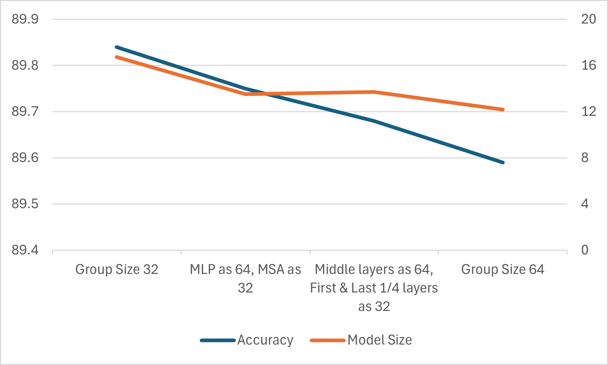
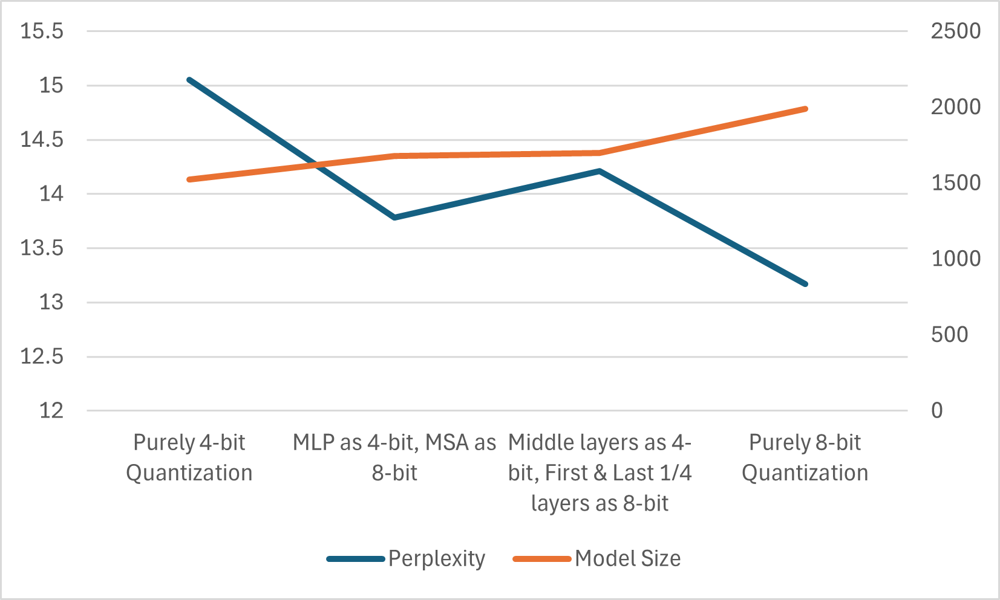
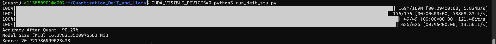
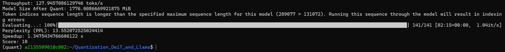

# **Quantization with HQQ**

## Introduction

This project aims to implement the linear quantization, then quantize the DeiT model & Small Language Model, resulting in reduced model size and potentially improved inference speed without significant loss in accuracy.

## Part 1 : Linear Quatization Implementation

This part is about how linear quantization works and how to implement the quantized version of **Fully Connected Layer** (Linear) and **Convolution Layer** (Conv2d).

The MobileNetV2 will be used in this part. You can download it here:
    > [mobilenetv2_0.963.pth](https://drive.google.com/file/d/1ls20ezKCJ38spHmFflN01NyvYjNLuDoH/view?usp=sharing)

## Part 2 : Quantize Vision Transformer & Small Language Model

In this part, we use [HQQ](https://github.com/mobiusml/hqq) library to perform quantization on two models: `DeiT-S` and `Llama3.2-1B-Instruct`.

* Environment Setting
    - Get Started
        ```bash
        sudo apt update
        sudo apt install build-essential
        sudo apt install python3-pip
        sudo apt install python3-venv
        sudo apt install git
        ```
    - Create a virtual environment
        ```bash
        python3 -m venv <your-env-name>
        exec bash   # for ubuntu which uses dash
        source <your-env-name>/bin/activate
        ```
    - Install the required packages
        ```bash
        pip3 uninstall torch torchvision torchaudio --yes
        pip3 install torch==2.6.0+cu124 torchvision torchaudio --index-url https://download.pytorch.org/whl/cu124
        pip3 install huggingface-hub[cli]
        pip3 install transformers==4.50.3
        pip3 install torch torchvision torchaudio
        pip3 install timm==1.0.15
        pip3 install datasets==3.5.0
        pip3 install accelerate==1.6.0
        pip3 install gemlite==0.4.4
        pip3 install hqq==0.2.5
        pip3 install triton==3.2.0
        ```
        Then
        ```bash
        huggingface-cli login --token [your_token]
        ```

### Section 2.1 : Quantize DeiT-S

Here we are performing classification task on **CIFAR100**, try to quantize the model to reduce its size as much as possible while maintaining high accuracy.

* Below is a `DeiT-S` model with 90.99% accuracy on **CIFAR100**. This model serves as a starting point for quantization:

    > [0.9099_deit3_small_patch16_224.pth](https://drive.google.com/file/d/1hLFiyLRBmlcvOnm8PSRRTN69GgPiV8YT/view?usp=sharing)

### Section 2.2 : Quantize Llama3.2-1B-Instruct

Language models place high demand on memory, especially as the number of parameters in new models continues to grow. Therefore, quantization is one of the solutions that reduces the memory usage. However, the quality of the response may decline due to lower precision of the model parameters. 

Now, we are performing quantization on `Llama3.2-1B-Instruct`, which is comparitively a small language model. We will use **PPL (perplexity)** to evaluate our quantized language model on **Wiki-Text-2**.


### Section 2.3 : Analysis

1. Quantization `DeiT-S` from FP32 to nbit integer (n=8,4,3,2). **(group_size=64)**
    
|       nbit       |   32   |  8  |  4  |  3  |  2  |
|:----------------:|:------:|:---:|:---:|:---:|:---:|
|   Accuracy (%)   |90.99|90.95|89.84|86.56|20.91|
| Model Size (MiB) |82.540|26.852|16.727|14.706|11.665|

2. Quantization `Llama3.2-1B-Instruct` from FP16 to nbit integer (n=8,4,3,2). **(group_size=64)** **(10%)**

|        nbit         |    16    |  8  |  4  |  2  |
|:-------------------:|:--------:|:---:|:---:|:---:|
|  Perplexity (PPL)   |13.160|13.168|15.051|215879.047|
|  Model Size (MiB)   |2858.129|1988.134|1524.134|1292.134|
| Throughput (toks/s) |93.062|111.065|148.222|164.196|


3. How we determine the quantization method for `DeiT-S` and `Llama3.2-1B-Instruct` for best performance?

##### DeiT-S
- Each Vision Transformer block contains a self-attention module and a multi-layer perceptron (MLP). The MSA includes QKV projection and self-attention computation, with denser parameter distribution, making it more sensitive during quantization. On the other hand, MLPs are less sensitive, allowing the use of slightly larger `group_size` and `nbits` to balance precision and computational efficiency.
- The input layer needs to capture raw feature details, while the output layer directly affects classification results. Therefore, smaller `group_size` and larger `nbits` are employed for the first and last layers.
- The first and last quarter layers, being closer to the input and output, adopt higher-precision quantization to preserve classification effectiveness. Conversely, middle layers employ relatively aggressive strategies to enhance model compression rates.
##### Llama3.2-1B-Instruct
- Similar to DeiT-S, the first quarter, middle layers, and last quarter layers are quantized using different strategies, with special handling for the first and last layers. Each Transformer layer's self-attention and fully connected parts also utilize distinct strategies.

Here is the visualized analysis:
- For DeiT-S, comparisons were made for **nbits=4** under **group_size=32/64/other strategies**, evaluating model size and precision changes.
  
- For Llama3.2-1B-Instruct, comparisons were made for **group_size=64** under **nbits=4/8** and other strategies, evaluating model size and PPL changes.
  

Actually, the challenges of Llama3.2-1B-Instruct are more pronounced. Using the same quantization strategy with 4-bit-64-group, the perplexity of the Llama model increases significantly, while the accuracy reduction in DeiT is relatively minor.

This may be because Llama3.2, as a language model, has input sequences with variable lengths and content, resulting in a more uneven distribution of activation values and potentially more extreme outliers. Furthermore, language models are highly sensitive to subtle numerical changes during inference, which can lead to accumulated errors.

On the other hand, DeiT is primarily used for image-related tasks, where input features are usually fixed-size images with relatively stable data distribution. Consequently, activation values and weight ranges in DeiT are more concentrated.


### Section 2.4 : Results
#### DeiT


2. For `Llama3.2-1B-Instruct`, TAs will run`run_slm.py` and load quantization configuration with your `get_quant_config_slm` function. The Score will be calculated base on the criteria below: 

    ```python
    score = 0
    score += 5 if PPL <= 14 else 0
    score += 5 if speedup >= 1.3
    ```

#### Llama3


## Reference
- [Introduction to Quantization - 1](https://medium.com/@anhtuan_40207/introduction-to-quantization-09a7fb81f9a4)
- [Introduction to Qunatization - 2](https://towardsdatascience.com/introduction-to-weight-quantization-2494701b9c0c/)
- [Visual Guide of Quantization](https://newsletter.maartengrootendorst.com/p/a-visual-guide-to-quantization)
- [Quantization Granularity](https://medium.com/@curiositydeck/quantization-granularity-aec2dd7a0bb4)
